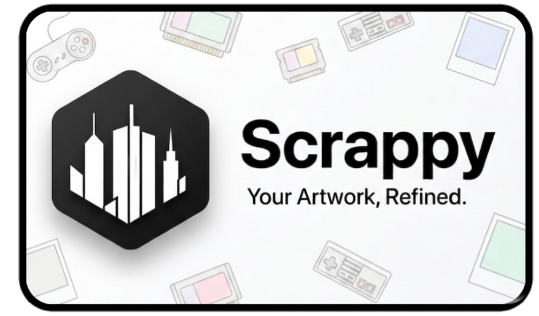
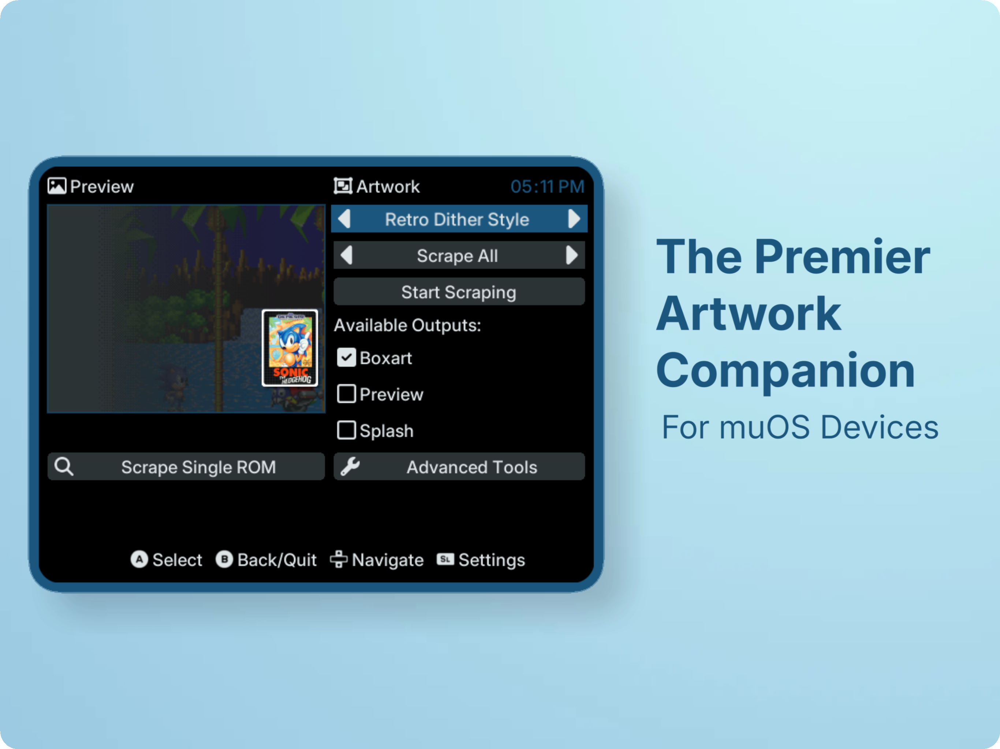
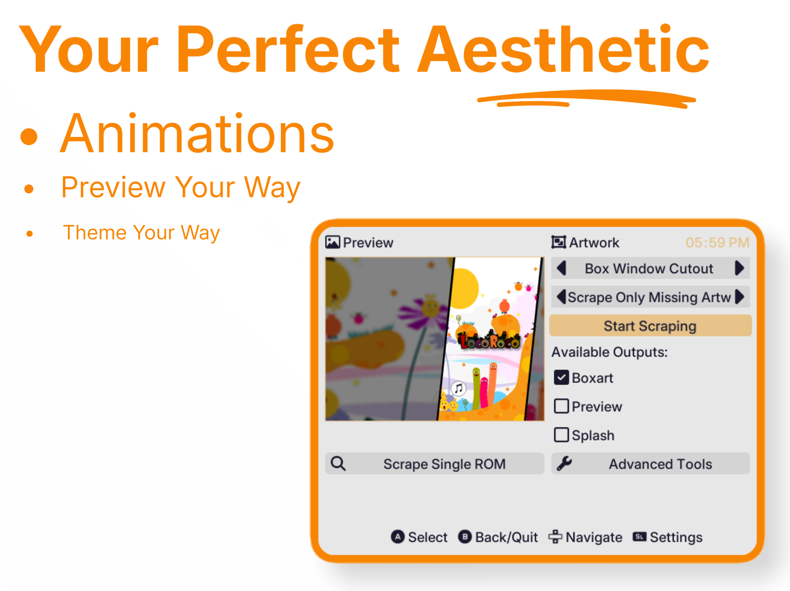
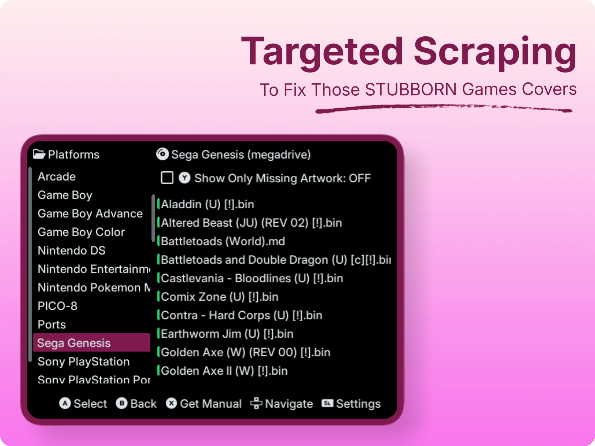
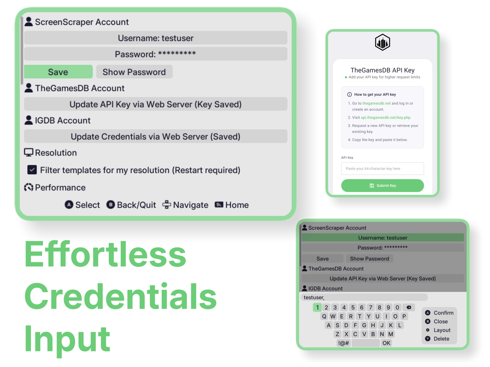
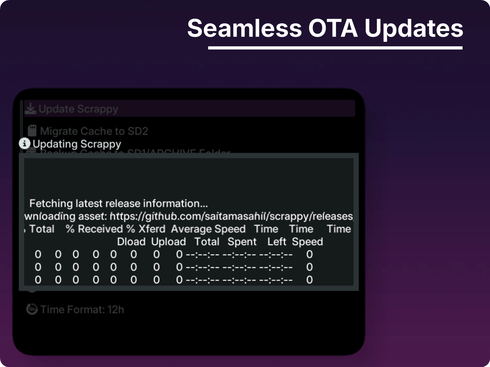
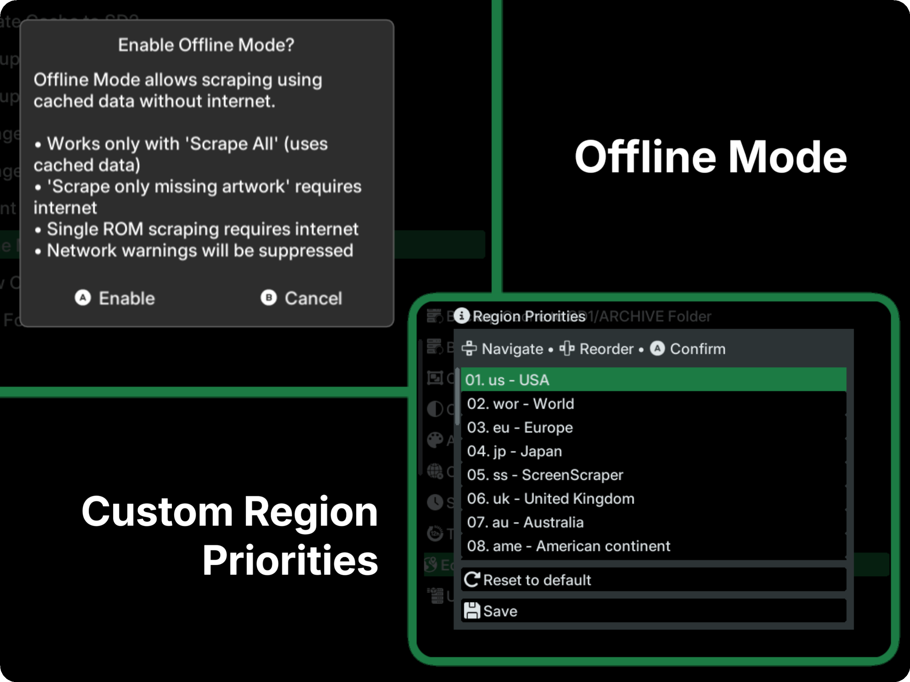
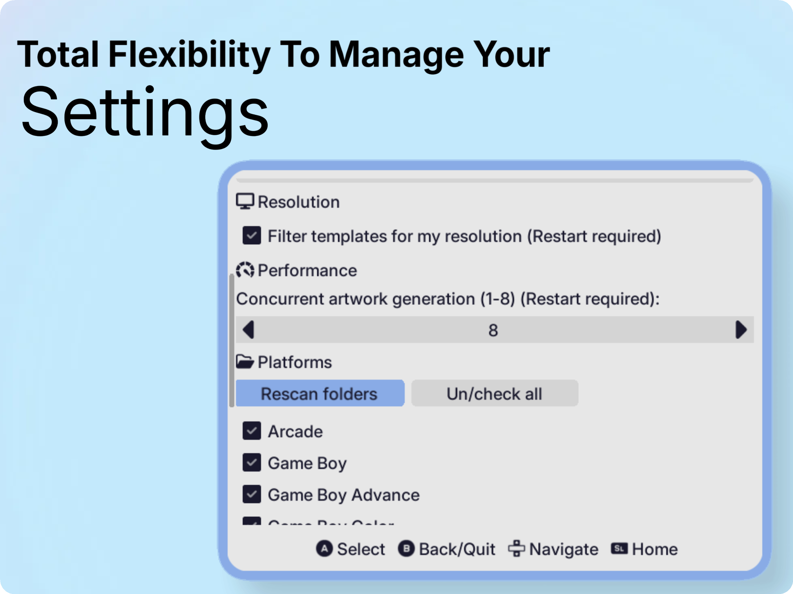
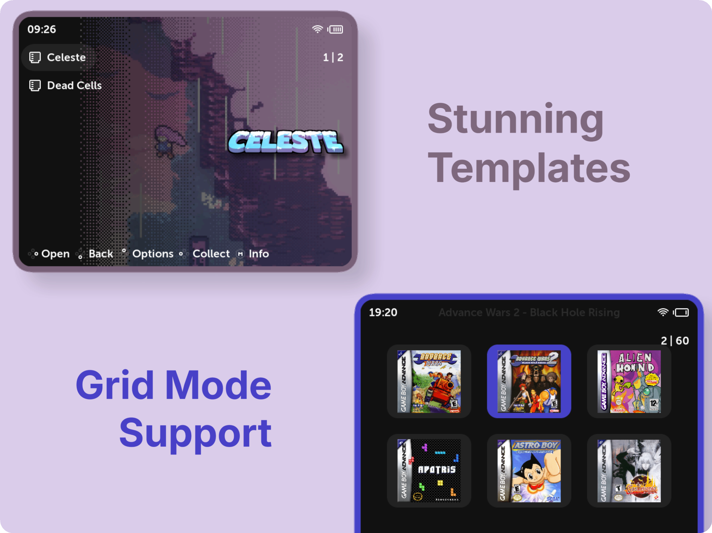
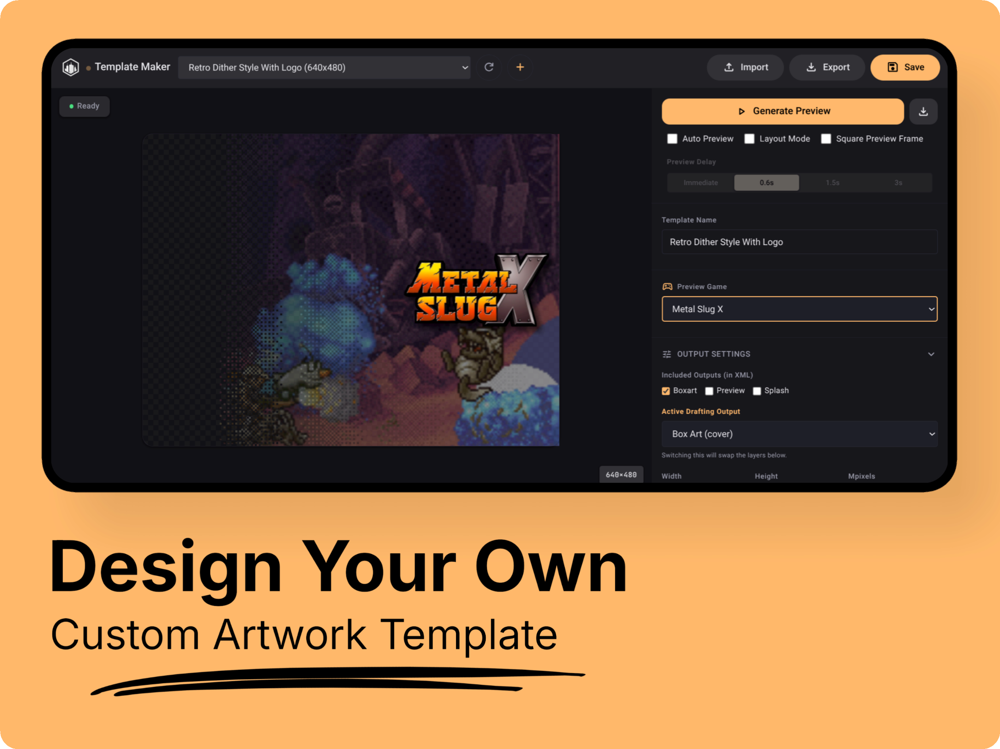

# Scrappy

<p align="center">
  
</p>

> Maintained fork by **saitamasahil** · Original author **gabrielfvale** · Original repo: https://github.com/gabrielfvale/scrappy

Scrappy is an artwork scraper for muOS, with the standout feature of incorporating a fully-fledged **Skyscraper** app under the hood. This integration enables near-complete support for artwork XML layouts, allowing Scrappy to scrape, cache assets, and generate artwork using XML mixes with ease. This fork of Scrappy is maintained to improve compatibility with muOS, add new features, provide ongoing updates, and ensure long-term support while staying true to the original vision of the project.

## A Visual Tour

<p align="center">
  
</p>
<p align="center">
  
</p>
<p align="center">
  
</p>
<p align="center">
  
</p>
<p align="center">
  
</p>
<p align="center">
  
</p>
<p align="center">
  
</p>
<p align="center">
  
</p>
<p align="center">
  
</p>
<p align="center">
  
</p>

## Installation
To install Scrappy, follow these steps:
1. Download the [latest release](https://github.com/saitamasahil/scrappy/releases) (not the update package - that's for OTA!).
2. Move the downloaded file to the `/mnt/mmc/MUOS/ARCHIVE` folder.
3. Open **Archive Manager** and select the file to install.
4. After installation, you'll find an entry called "Scrappy" in the **Applications** section.
5. Please read the [FAQ](FAQ.md) for more info on usage and configuration, and refer to the official [muOS Artwork Documentation](https://muos.dev/installation/artwork) for details on muOS artwork.

### Fixing White Grid Boxes in Grid View
If you notice white boxes tinting or obscuring artwork in muOS Grid View while using certain themes like **OneTwo**, you can disable cell image recoloring specifically for the muOS content explorer (`muxplore`).

Add the following lines to your `/MUOS/theme/override/muxplore.ini` file:

```ini
[grid]
CELL_DEFAULT_IMAGE_RECOLOUR_ALPHA = 0
CELL_FOCUS_IMAGE_RECOLOUR_ALPHA = 0
```

> **Note:** This safely overrides cell recoloring options specifically for the content explorer screen without affecting the rest of your system theme.

## Resources

- **muOS Artwork Documentation** - Official guide on muOS artwork catalogue paths and structure [muOS Docs](https://muos.dev/installation/artwork)
- **Skyscraper** - Artwork scraper framework by Gemba [Skyscraper on GitHub](https://github.com/Gemba/skyscraper)
- **ini_parser** - INI file parser by nobytesgiven [GitHub](https://github.com/nobytesgiven/ini_parser)
- **nativefs** - Native filesystem interface by EngineerSmith [GitHub](https://github.com/EngineerSmith/nativefs)
- **timer** - Lightweight timing library by vrld [GitHub](https://github.com/vrld/hump)
- **boxart-buddy** - A curated box art retrieval library & used mask PNG assets from `assets/image/mix/mask` [GitHub](https://github.com/boxart-buddy/boxart-buddy)
- **LÖVE** - framework for 2D games in Lua [Website](https://love2d.org/)
- **LÖVE aarch64 binaries** - LOVE2D binary files for aarch64 [Arch Linux Arm](https://archlinuxarm.org/packages/aarch64/love) and [Cebion](https://github.com/Cebion/love2d_aarch64)

## Special thanks

- **chronoss09** - for testing infinite test builds of scrappy and providing custom console frames [GitHub](https://github.com/chronoss09)
- **10NES** - for testing and providing detailed feedback on the bug report
- **Snow (snowram)** - for the initial Qt5 build work that inspired the Qt6 upgrade [Kofi](https://ko-fi.com/snowram)
- **Portmaster and their devs** - for great documentation on porting games/software for Linux handhelds [Portmaster](https://portmaster.games/porting.html)
- **Scrappy's original developer [Gabriel Freire](https://github.com/gabrielfvale)** - for creating Scrappy and laying the foundation for this project. Support their work at [Kofi](https://ko-fi.com/gabrielfvale)
- **JochemKuipers** - for integrating IGDB support [GitHub](https://github.com/JochemKuipers)
- **SethG911** - for fixing scraping hangs and adding concurrency controls [GitHub](https://github.com/SethG911)
- **TheWalruzz** - for updating storage paths & adding Fluent theme compatible template [GitHub](https://github.com/TheWalruzz)
- **antiKk** - for invaluable technical guidance, detailed logs, and testing to enable **RG Vita Pro** support [GitHub](https://github.com/antiKk)
- **bulkh** - for the amazing UI sounds from the OneTwo theme [GitHub](https://github.com/bulkh/OneTwo)
- **MIMI** - for providing the XML artwork template for Trimui Brick [GitHub](https://github.com/indigo206888)
- Testers and many other contributors

## Supporting the project
If you find this project useful, please consider leaving a [star on GitHub](https://github.com/saitamasahil/scrappy)

If you would like to support my work & this fork further, you can donate here:

[](https://ko-fi.com/saitamasahil)

## Contributing

Contributions to Scrappy are welcome! Please fork the repository, make your changes, and submit a pull request.

## Build from source

Scrappy includes build scripts for packaging releases on both Linux and Windows.

### Bash (Linux)
Requirements:
- bash
- zip

```bash
# Build both packages (default)
./build.sh

# Build ONLY the full package
./build.sh --full

# Build ONLY the update package
./build.sh --update
```

### PowerShell (Windows)
Requirements:
- PowerShell 5.1 or later

```powershell
# Build both packages (default)
./build.ps1

# Build ONLY the full package
./build.ps1 --full

# Build ONLY the update package
./build.ps1 --update
```

Troubleshooting:
- On Linux, make the script executable: `chmod +x build.sh`
- On Windows, you may need to allow script execution: `Set-ExecutionPolicy -ExecutionPolicy Bypass -Scope Process`

## License

This project is licensed under the MIT License. See `LICENSE.md` for more details.
